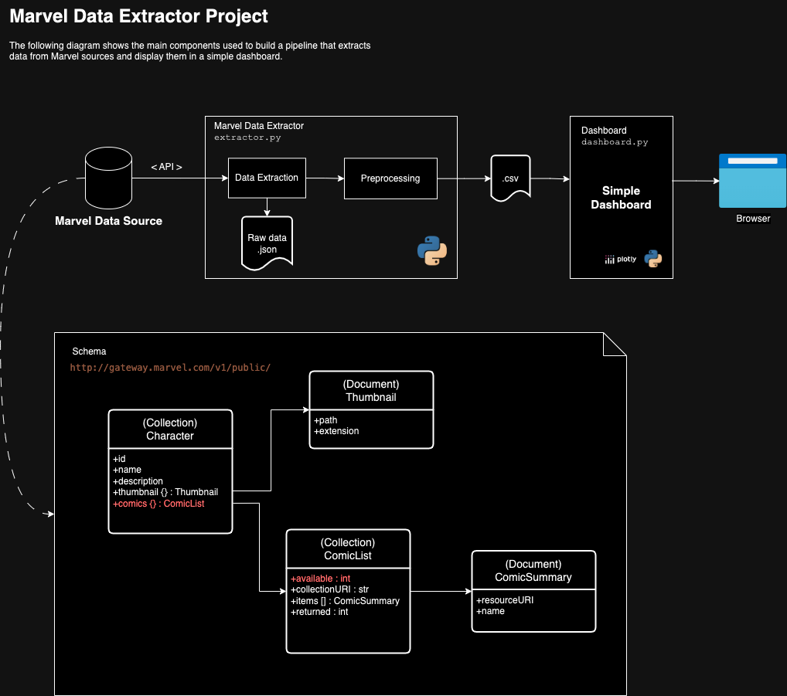

# MarvelProject
A solution to extract data of Marvel characters from its official public source.

## Solution

This is a simple solution developed fully in Python.

The following diagram shows the main components used to build a pipeline that extracts data from Marvel sources and display them in a simple dashboard.



## How to install

1. Create and activate a virtual environment

```
python -m venv venv
source venv/bin/activate
```

2. Install the required dependencies 

```
pip install -r requirements.txt
```

3. Get an api key from https://developer.marvel.com/signup and write your public and private keys in a file named `.env`. You can use the file `.env_sample` as an example.

4. Load the environment variables 

```
source .env
```

## How to run

### First step: extract the data

To extract the data, run

```
python extractor.py
```

By default, the data is downloaded in a folder named `data`.

### Second step: visualize the data

To visualize the dashboard, you must first download the data as described in the previous step. Once the required file is in `data/characters.csv`, then run:

```
python dashboard.py
```

## Additional methods
    
Get the number of comics in which a given character appears in. For example, for character id 1009146:
```    
data = mv.get_character_comics(1009146)
df = pd.DataFrame(data=data)
print(df["id"].nunique())
```

Get 2000 comic details and save them to a json file

```
data = mv.get_comics(limit=2000)
mv.save_to_file(data, "data/comics_sample.json")
```